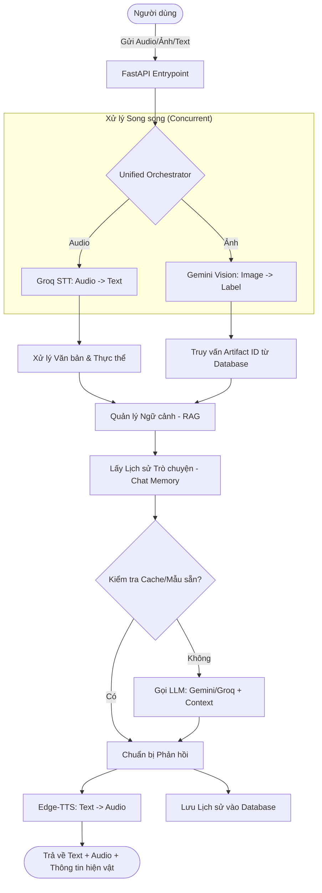
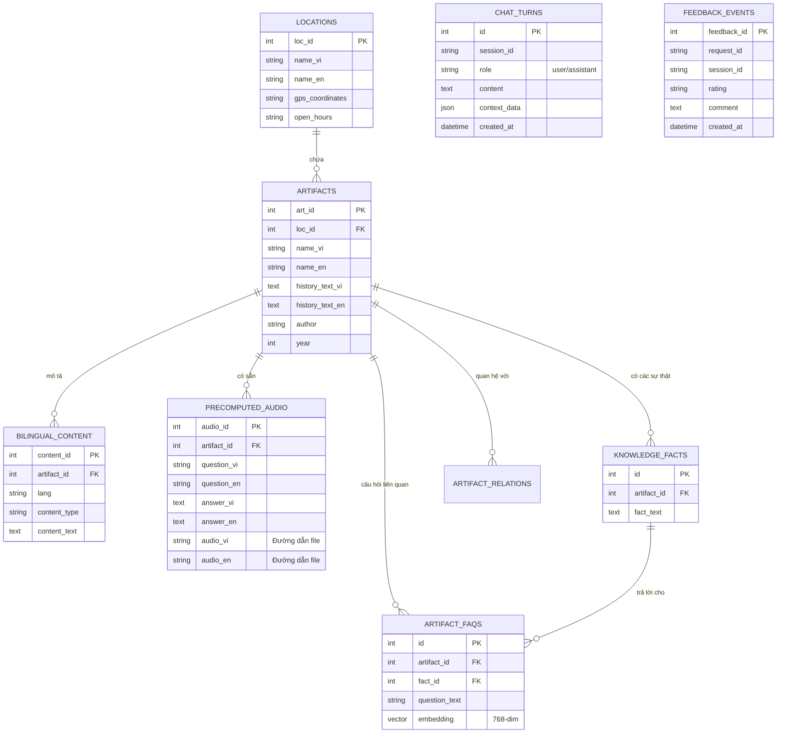

# Báo cáo Kiến trúc Backend và Cơ sở dữ liệu - AI Tour Guide

Tài liệu này mô tả chi tiết cách thức hoạt động của hệ thống Backend, cấu trúc Cơ sở dữ liệu (Database), luồng xử lý dữ liệu và các phương thức lưu trữ của dự án AI Tour Guide.

## 1. Tổng quan Công nghệ (Tech Stack)

Hệ thống được xây dựng trên mô hình hiện đại, tối ưu cho xử lý đa phương thức (Multimodal):

*   **Backend Framework**: FastAPI (Python 3.10+) - Hỗ trợ xử lý bất đồng bộ (Async) mạnh mẽ.
*   **Database**: PostgreSQL - Lưu trữ dữ liệu quan hệ.
*   **Vector Search**: pgvector - Hỗ trợ tìm kiếm ngữ nghĩa cho các câu hỏi FAQ.
*   **Caching**: Redis - Tăng tốc độ phản hồi và quản lý Rate Limiting.
*   **AI Services**:
    *   **Google Gemini**: Sử dụng cho Vision (nhận diện ảnh), Embeddings và LLM chính.
    *   **Groq**: Sử dụng cho STT (Chuyển giọng nói thành văn bản) và LLM dự phòng (Llama 3).
    *   **Edge-TTS**: Chuyển đổi văn bản thành giọng nói (TTS) tự nhiên.

---

## 2. Luồng hoạt động của Hệ thống (System Flow)

Hệ thống sử dụng một bộ điều phối thống nhất (`UnifiedOrchestrator`) để xử lý đồng thời các yêu cầu đầu vào từ người dùng (Văn bản, Giọng nói, Hình ảnh).

### Sơ đồ Luồng hoạt động (Mermaid)

---

## 3. Cấu trúc Cơ sở dữ liệu (Database Schema)

Cơ sở dữ liệu được thiết kế để hỗ trợ thông tin đa ngôn ngữ, hệ thống kiến thức (Knowledge Graph) và tìm kiếm Vector.

### Sơ đồ Thực thể Quan hệ (ERD Mermaid)

---

## 4. Cơ chế Lưu trữ và Truy xuất

### 4.1. Lưu trữ ở đâu?
1.  **Dữ liệu quan hệ (Thông tin hiện vật, lịch sử, feedback)**: Lưu trong **PostgreSQL**.
2.  **Dữ liệu Vector (Embeddings của câu hỏi)**: Lưu trong PostgreSQL sử dụng extension **pgvector**. Điều này cho phép tìm kiếm câu hỏi có ý nghĩa tương đồng nhất với câu hỏi của người dùng.
3.  **Dữ liệu Cache**: Lưu trong **Redis** (Session ngắn hạn, Rate limit).
4.  **Dữ liệu Âm thanh (Audio)**: Các file âm thanh pre-computed (nếu có) thường được lưu trên Disk hoặc Cloud Storage, và đường dẫn được lưu trong bảng `precomputed_audio`.

### 4.2. Cách thức hoạt động của RAG (Retrieval-Augmented Generation)

Hệ thống RAG của AI Tour Guide không chỉ là tìm kiếm văn bản đơn thuần mà là một sự kết hợp tinh vi giữa nhiều kỹ thuật (Hybrid Search):

1.  **Tiền xử lý (Transcript Canonicalization)**:
    *   Văn bản từ giọng nói (STT) thường bị sai lệch chính tả. Backend thực hiện "chuẩn hóa thực thể" (Canonicalization) để đưa các từ sai về đúng tên hiện vật/địa danh có trong cơ sở dữ liệu trước khi thực hiện tìm kiếm.

2.  **Tìm kiếm Hybrid (Vector + Graph)**:
    *   **Vector Search**: Chuyển câu hỏi của người dùng thành Vector (768 chiều) bằng model `gemini-embedding-2`. Sau đó tìm kiếm trong bảng `artifact_faqs` bằng thuật toán Cosine Similarity để tìm các câu hỏi tương đồng.
    *   **Graph-Augmented Retrieval**: Từ các hiện vật tìm được ở bước Vector, hệ thống tiếp tục truy vấn bảng `artifact_relations` để tìm các hiện vật liên quan (cùng tác giả, cùng thời kỳ, hoặc nằm gần nhau). Điều này giúp AI có cái nhìn toàn diện hơn để trả lời.

3.  **Định vị và Tái xếp hạng (GPS Reranking)**:
    *   Nếu người dùng cung cấp tọa độ GPS, hệ thống sẽ ưu tiên các hiện vật ở gần vị trí của người dùng nhất trong danh sách kết quả tìm được.

4.  **Bơm Ngữ cảnh (Prompt Augmentation)**:
    *   Dữ liệu thô từ DB (Lịch sử, năm xây dựng, tác giả) được định dạng lại thành một cấu trúc logic và "bơm" vào System Prompt của LLM.
    *   Điều này giúp LLM đóng vai một hướng dẫn viên chuyên nghiệp, chỉ trả lời dựa trên sự thật đã được kiểm chứng trong DB, giảm thiểu tình trạng AI tự bịa đặt thông tin.

### 4.3. Tối ưu hóa phản hồi (Caching & Templates)
Để giảm chi phí API và tăng tốc độ, Backend sử dụng cơ chế:
*   **Template Matching**: Trả lời ngay các câu chào hỏi hoặc câu hỏi đơn giản (năm xây dựng, tác giả) nếu đã có sẵn trong DB.
*   **In-memory Cache**: Lưu các câu trả lời vừa tạo cho cùng một hiện vật trong phiên làm việc.

---

## 5. Mạng lưới Tri thức (Knowledge Graph Network)

Hệ thống sử dụng mô hình **Knowledge Graph** để kết nối các thực thể lịch sử không chỉ theo vị trí địa lý mà còn theo các mối quan hệ ngữ nghĩa sâu sắc.

### 5.1. Cấu trúc Đồ thị
*   **Các Nút (Nodes)**: Là các `Artifact` (Hiện vật) hoặc `Location` (Địa điểm).
*   **Các Cạnh (Edges)**: Định nghĩa trong bảng `artifact_relations`, bao gồm các loại quan hệ: `SAME_AUTHOR`, `SAME_PERIOD`, `LOCATED_NEAR`, `HISTORICAL_LINK`.

### 5.2. Tự động hóa xây dựng Đồ thị (Automated Discovery)

Thay vì nhập liệu thủ công, hệ thống tích hợp script `scripts/build_graph.py` sử dụng **Gemini 2.0 Flash** để tự động "học" mạng lưới tri thức:

1.  **Phân tích ngữ nghĩa**: AI đọc hiểu văn bản lịch sử của từng hiện vật.
2.  **Trích xuất sự thật**: Tự động chia nhỏ thông tin thành các thực thể tri thức (Knowledge Facts) súc tích.
3.  **Khám phá mối liên hệ**: AI tự đối soát với danh sách hiện vật hiện có để thiết lập các quan hệ mà không cần sự can thiệp của con người.

Cơ chế này giúp hệ thống có khả năng mở rộng (Scalability) cực cao: Khi thêm một hiện vật mới, mạng lưới tri thức sẽ tự động được cập nhật và kết nối với các dữ liệu cũ.

---
## 6. Các khuyến nghị tối ưu hóa dữ liệu

Để hệ thống hoạt động tốt nhất, các bước sau được khuyến nghị:

1.  **Làm giàu Vector FAQ**: Sử dụng AI để tạo ra nhiều biến thể câu hỏi khác nhau cho mỗi hiện vật để tăng độ phủ của tìm kiếm ngữ nghĩa.
2.  **Kiểm tra tính nhất quán (Consistency Check)**: Đảm bảo dữ liệu đa ngôn ngữ luôn đồng bộ.
3.  **Tối ưu hóa Embedding**: Sử dụng các thiết lập `task_type` chuyên biệt cho Query và Document để đạt độ chính xác cao nhất.

---
*Báo cáo được thực hiện bởi AI Tour Guide Assistant.*
